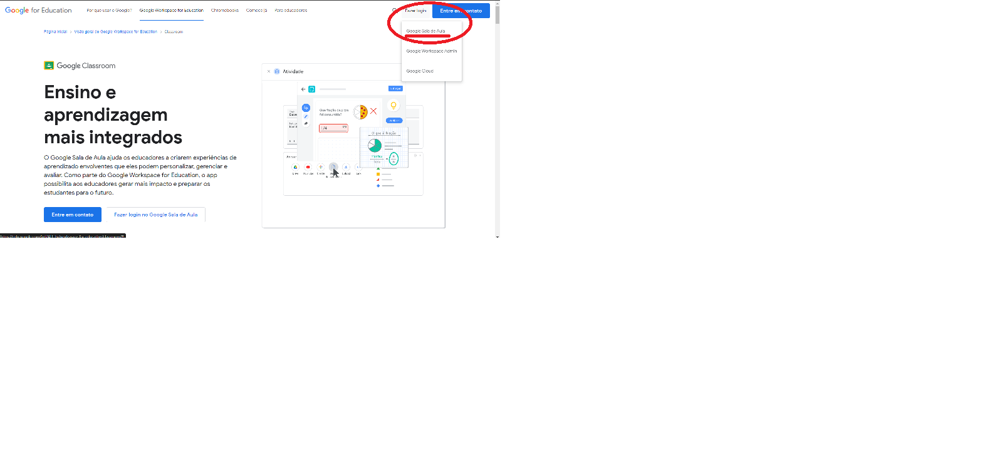

# Aula 00 Preparação para o curso

Video da aula: [COLOCAR]

ATENÇÃO, AINDA NÃO HÁ PREVISÃO DE QUANDO O CURSO VAI COMEÇAR. Devido à minha rotinha de trabalho, esse curso não vai começar tão cedo. Se você topou com alguma parte dele por acidente, volte em 2025.

O curso será disponibilizado via Google Classroom, esse curso é completamente gratuito. O link da sala de aula é [COLOCAR] e o início das aulas serão dia [A MARCAR]

As aulas do curso também estarão disponíveis nos seguintes canais do youtube [COLOCAR]

O material do curso (Apostilas e apresentações) estarão disponíveis no google drive [COLOCAR LINK]

Os códigos do curso estartão disponíveis em no [Repositório do Curso](https://github.com/FMoller/algorithms101)

## O Google Classroom:

O [Google Classroom](https://classroom.google.com/) é uma plataforma do google para ensino a distância. Lá é possível assistir aos vídeos das aulas, realizar perguntas e fazer os testes teóricos.
Para entrar, você precisa de uma conta google (se você tem gmail, ou conta no youtube, você já tem uma). No canto superior direito você poderá fazer login selecionando a opção FAZER LOGIN, GOOGLE SALA DE AULA

